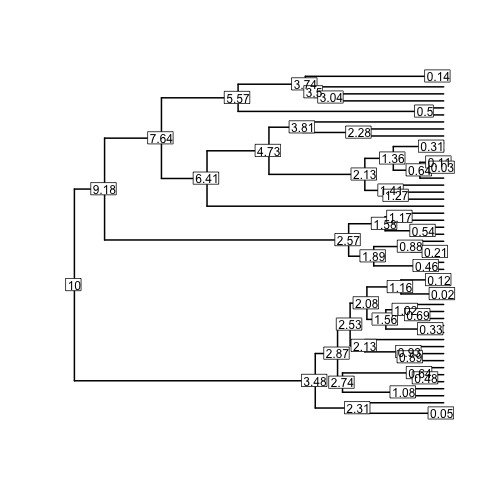
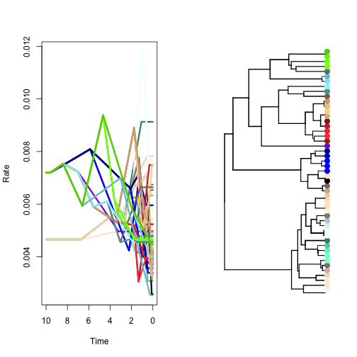

Simulating alignments under models of rate of evolution with a specific number of variable sites
================================================================================================

- Sebastian Duchene
May 13 2014


In this example I use an uncorrelated lognormal clock model (UCLN)  to simulate a data set with 10,000 nucleotides and between 4700 and 5200 variable sites. The mean rate will be 0.005, with a standard deviation of 0.3 (30% of the mean). Note that the rate is specified in log scale, so it should be specified as $\frac{0.005}{6}$. The actual number of variable sites depends on the stochasticity of the simulations, so it may be necessary to simulate several data sets, until the data set has the desired number of variable sites (between 4700 and 5200 for this example). For this simulaton I use the default substitution model in the simSeq function (type ?simSeq for more details).


Load the necessary pacakges:


```coffee
library(NELSI)
library(phangorn)
```


Load a one of the trees from the simulation study (Ho *et al*. )


```coffee
example_tree <- read.tree("yuletr9.tre")
```


Scale the tree to 10 time units


```coffee
example_tree$edge.length <- example_tree$edge.length/(max(branching.times(example_tree))/10)
```


Plot the tree with the ages in the nodes. This corresponds to the chronogram:


```coffee
plot(example_tree, show.tip.label = F, edge.width = 2)
nodelabels(round(branching.times(example_tree), 2), bg = "white")
```

 


Run a maximum of ten simulations to obtain the specified number of variable sites. Specifying a maximum number of simulations is convenient to avoid infinite loops with data sets where the specified number of variable sites are very unlikely. 


```coffee
variable_sites <- 0  # Initiate with a dummy number to start the while loop
i <- 1  # define a variable to count the number of iterations

while (variable_sites >= 5200 | variable_sites <= 4700) {
    i <- i + 1
    sim_UCLN <- simulate.uncor.lnorm(example_tree, params = list(mean.log = log(0.005), 
        sd.log = 0.3))
    alignment_UCLN <- as.DNAbin(simSeq(sim_UCLN$phylogram, l = 10000))
    variable_sites <- length(seg.sites(alignment_UCLN))
    print(paste("This is iteration number", i, "The number of variable sites is", 
        variable_sites))
    
    if (i == 10) 
        stop("In 10 iterations I could not simulate a data set with the secified number of variable sites\ntry using a different rate value, or a tree with a different root age")
    
}
```

```
## [1] "This is iteration number 2 The number of variable sites is 4574"
## [1] "This is iteration number 3 The number of variable sites is 4520"
## [1] "This is iteration number 4 The number of variable sites is 4494"
## [1] "This is iteration number 5 The number of variable sites is 4381"
## [1] "This is iteration number 6 The number of variable sites is 4426"
## [1] "This is iteration number 7 The number of variable sites is 4692"
## [1] "This is iteration number 8 The number of variable sites is 4712"
```


Plot the data with NELSI standard plots:

```coffee
plot(sim_UCLN)
```

 


Write the data to an external file:
```coffee
write.dna(alignment_UCLN, file = "simulation_yule9.fasta", format = "fasta")
```
