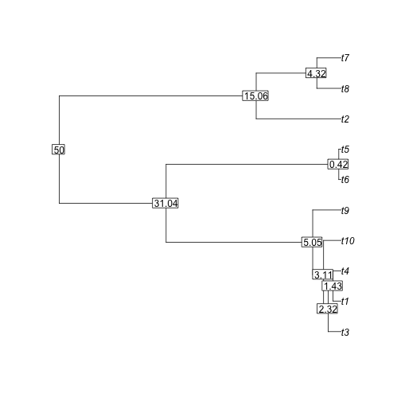
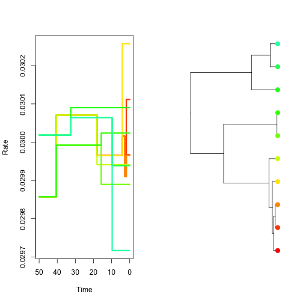
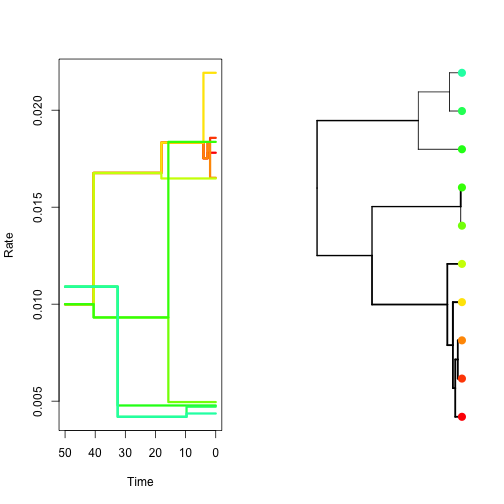
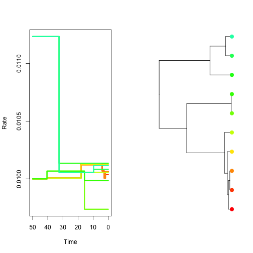
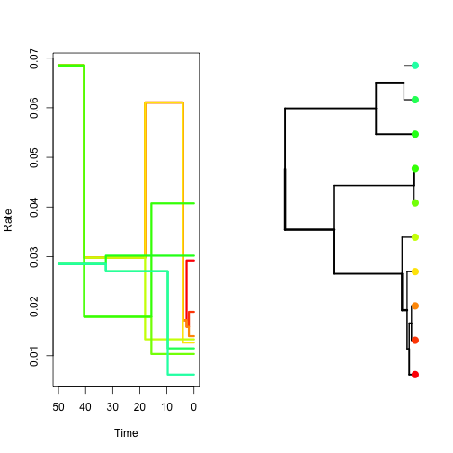
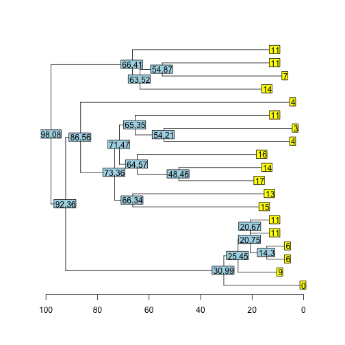

NELSI: Nucleotide EvoLutionary Rate Simulator
=============================================


David Duchene and Sebastian Duchene

david.duchene[at]anu.edu.au

sebastian.duchene[at]sydney.edu.au

X April 2014


1. Installation and setup
-------------------------

NELSI requires a recent version of R (>=2.5). If R is not installed in your machine, download and install the appropriate version [here](www.r-project.org). 

R packages can be downloaded and installed directly from [github](github.com/sebastianduchene/nelsi) with the package [devtools](https://github.com/hadley/devtools). This is the easiest way to install NELSI (and many other packages). 

We will begin by installing devtools from the Comprehensive R Archive Network (CRAN). Please follow the instructions bellow:

 - Open the R console by clicking on the R icon in your desktop or in Applications (depending on the operating system)

 - Make sure that you have an internet connection and type in the code bellow:

```
install.packages("devtools")
```

Follow the instructions in the prompt. 

 - Load devtools with the following code:

```
library(devtools)
```

 - The devtools package has a function to download packages from github repositories. To download and install NELSI type the following at the prompt:

```
install_github(rep = "NELSI", username = "sebastianduchene")
```

 - NELSI is now installed. To make all the functions available, load the package by typing:


```r
library(NELSI)
```

<<<<<<< HEAD
```
## Loading required package: ape
## Loading required package: epibase
## Loading required package: ggplot2
## Need help? Try the ggplot2 mailing list: http://groups.google.com/group/ggplot2.
## Loading required package: network
## network: Classes for Relational Data
## Version 1.9.0 created on 2014-01-03.
## copyright (c) 2005, Carter T. Butts, University of California-Irvine
##                     Mark S. Handcock, University of California -- Los Angeles
##                     David R. Hunter, Penn State University
##                     Martina Morris, University of Washington
##                     Skye Bender-deMoll, University of Washington
##  For citation information, type citation("network").
##  Type help("network-package") to get started.
## 
##  epibase 0.1-3 has been loaded
## 
## Loading required package: geiger
```


=======
>>>>>>> testing
This is all for the installation of NELSI. Please contact the authors to report any bugs.


2. Loading phylogenetic trees
-----------------------------

To simulate rates of evolution we need a phylogenetic tree in which the branch lengths repesetn units of time, known as a chronogram. We can simulate this kind of tree in R, but for this tutorial we will load the tree in the example_data folder in [github](github.com/sebastianduchene/nelsi). 

 - Set the R [working directory](http://www.statmethods.net/interface/workspace.html) to the example_data folder. Load the example tree with the following code:


```r
myTree <- read.tree("tr_example.tree")
```


 - To get more insight into the chronogram that we have loaded, we can plot it and annotate each node with its age.


```r
plot(myTree)
node.ages <- round(branching.times(myTree), 2)
nodelabels(node.ages, bg = "white")
```

 


3. Simulate constant rates through time
---------------------------------------

The simplest rate simulation model in NELSI is a strict clock, where every branch is given the same rate, with a user-specified noise level. To simulate rates under this model for our chronogram we use the function simulate.cock, which receives as arguments the chronogram, and two parameters: the mean rate and the amount of noise. 

 - As an example, we will simulate a high rate of substitutions and a high level of noise. Remember that because this is a simulations context, the results will vary every time the function is run. Note that the range of the rates along the y axis is very low.


```r
clock.sim <- simulate.clock(myTree, params = list(rate = 0.03, noise = 1e-04))
```

```
## Loading required package: phangorn
```


The output is an object of class ratesim, which is the output of all the rate simulation functions in NELSI. ratesim objects have two elements. The first is a phylogram (our input topology but with branch lengths in terms of substitutions). The second element in an object of class ratesim is a tree.data.matrix, which is a matrix with all the data about a phylogeny, includng the simulated data. The columns of a tree.data.matrix are the following: (1) is the index of each branch; (2) and (3) are the edge attribute of the class phylo, showing the parent and daughter nodes for each branchrespectively; (4) is the mid age of each branch; (5) is the simulated molecular rate for every branch; (6) is the branch lengths in substitutions per site; and (7) is branch lengths in time units.

 - To observe how the rate changes through time in each lineage, you can plot the output of your simulation function directly using the ratesim object. The fist plot will show the rate through time for each lineage, while the second shows the chronogram with the tips coloured proportional to the rate. Therefore, colours of lines in the first plot correspond to the colours of tips in the second plot. The width of the branches is proportional to the rate.


```r
plot(clock.sim, col.lineages = rainbow(20), type = "s")
```

 


4. Simulate autocorrelated rates
--------------------------------

One way to relax the assumption of having a single rate throughout is to propose small changes in rate from one branch to the next. The functions simulate.autocor.kishino and simulate.autocor.thorne use the method described in Kishino *et al*.(2001) and Thorne *et al.*(1998) methods to simulate this kind of rate pattern. In both functions the user only needs to provide the rate at the root of the phylogeny and the amount of autocorrelation, given by the parameter v. 

 - Using the following code simulate and plot autocorrelated rates using simulate.autocor.kishino; first with low autocorrelation, and then with high autocorrelation.


```r
sim.low.autocor <- simulate.autocor.kishino(myTree, params = list(initial.rate = 0.01, 
    v = 0.1))
sim.high.autocor <- simulate.autocor.kishino(myTree, params = list(initial.rate = 0.01, 
    v = 0.003))
plot(sim.low.autocor, col.lineages = rainbow(20), type = "s")
```

 


```r
plot(sim.high.autocor, col.lineages = rainbow(20), type = "s")
```

 


5. Simulate uncorrelated lognormal rates
----------------------------------------

To simulate rates that are uncorrelated among branches, but are independently and identically drawn from a parent distribution, we have implemented three different models for rate simulation. Each function requires different input parameters, as described in Drummond *et al.* (2006).

 - Using the following you can simulate rates under an uncorrelated lognormal rates model, which requires the log mean and the standard deviation of the parent distribution. Note that the width of the branches varies, representing rate variation among the branches.
 

```r
sim.uncor <- simulate.uncor.lnorm(myTree, params = list(mean.log = -3.9, sd.log = 0.7))
plot(sim.uncor, col.lineages = rainbow(20), type = "s")
```

 


There are other methods for rate simulation in NELSI, but this tutorial covers the most well-known models. Please refer to the package doccumentation and help files for a full list of functions.


6. Simulate nucleotide sequences using phangorn and export the data
------------------------------------------------------------------

We can use the package phangorn to simulate evolvution of nucleotide or amino-acid sequence alignments along a phylogram (the first element of the ratesim object), and save it in an external file in a any format, such as FASTA, for future use.

 - Simulate a DNA alignment 2000 base-pairs long, and save it in a file.
 

```r
sim.dna.data <- simSeq(sim.uncor[[1]], l = 2000, type = "DNA")
write.phyDat(sim.dna.data, file = "nelsi_tutorial_dna.fasta", format = "fasta")
```
Note that the function simSeq can simulate under different models of nucleotide substitution. Use ?simSeq to see details.

- Now save the phylogram in newick format for future reference or comparison, using the ape package.


```r
write.tree(sim.uncor[[1]], file = "nelsi_tutorial_pylogram.tree")
```


7. Loading a virus data set estimated in BEAST 
-----------------------------------------------

Phylogenetic trees in NEXUS format can have a large number of annotations, with information about rates, times, or other traits for every branch in the tree. These annotations can be read in R with the pacakge [epibase](http://www.inside-r.org/packages/cran/epibase) and then imported into a tree data matrix to be used with NELSI.

The examples_data folder contains a tree from *ENV* sequences from HIV-1 sub-type A collected between 1991 and 2008. 

 - Type the following code to read the tree (remember to set the working directory to the example_data folder):


```r
hivTree <- read.annotated.nexus("hiv_A_env.tree")
```


 - Plot the tree with the function plot:


```r
plot(hivTree)
axisPhylo()
```

 


The tree is a chronogram, so that the branch lengths represent units of time. The ages of the nodes can be obtained with the function branching.times, but this only works for ultrametric trees, which is not the case for these data because the samples were obtained at different points in time (heterochronous). The function allnode.times in NELSI can obtain the ages of the nodes and tips for heterochronous trees. The first items of the function are the ages of the tips, and the remaining are the ages of internal nodes.

 - Type the following code to plot the tree with out taxon names. Instead add the ages of the tips and internal nodes with the tiplabel and nodelabel functions. 


```r
plot(hivTree, show.tip.label = F)
tip.ages <- round(allnode.times(hivTree), 2)  # Round to two decimal places for a clearer plot
# See the tip ages. The first 19 elements are the ages of the tips (the tree
# has 19 tips), while the remaining are the ages of internal nodes
tiplabels(tip.ages[1:19])
nodelabels(tip.ages[20:37])
axisPhylo()
```

 


The age of the youngest tip is always assigned an age of 0. The age of the root is calculated with reference to the youngest tip.


8. Obtaining the tree data matrix for a tree estimated in BEAST
---------------------------------------------------------------

We will use the tree in 7. to obtain the tree data matrix and plot the rates through time.

 - Use the function get.tree.data.matrix for the HIV tree in 7 and inspect the tree data matrix:


```r
hivDataMatrix <- trann2trdat(hivTree)

head(hivDataMatrix)
```

```
##   branch parent daughter midage     rate blensubs blentime
## 1      1     20       21 154.55 0.001301  0.02622   20.159
## 2      2     21       22  99.35 0.001314  0.12836   97.721
## 3      3     22        1  32.00 0.001286  0.05929   46.113
## 4      4     22       23  49.50 0.001274  0.01112    8.730
## 5      5     23        2  31.84 0.001332  0.03859   28.980
## 6      6     23       24  41.23 0.001291  0.01154    8.936
```


9. Root-to-tip regressions for trees estimated in BEAST
-------------------------------------------------------

For heterochronous data one can test the molecular clock by conducting a regression of the number of substitutions from the root to the tips vs. the time from the root to the tip, like in the program [Path-o-Gen](http://tree.bio.ed.ac.uk/software/pathogen/) (Rambaut *et al.* 2009). With the help of a few functions from NELSI, we can conduct these analyses in R.

 - Obtain the ages of the tips with the function allnode.times with the HIV chronogram. Specify the argument tipsonly = T, which will return the ages of the tips, and not those of internal nodes.


```r
tipsTimes <- allnode.times(hivTree, tipsonly = T)
```


 - We can use the tree data matrix from 8. to obtan the HIV phylogram (with branch lengths in substitutions). To do this, create a copy of the chronogram in variable hivPhylogram and set the branch lengths to the number of substitutions from the tree data matrix:


```r
hivPhylogram <- hivTree
hivPhylogram$edge.length <- hivDataMatrix$blensubs
```


 - The root-to-tip distances in the phylogram are the number of substutions from the root to the tips. Save this in an other variable:


```r
tipsSubstitutions <- allnode.times(hivPhylogram, tipsonly = T)
```


 - The variables tipsTimes and tipsSubstitutions can be used to plot the data and test the linear regression with basic linear models:


```r
plot(tipsTimes, tipsSubstitutions, pch = 20, ylab = "Substitutions from the root to tips (substitutions)", 
    xlab = "Time from the root to the tip (years)")
hivRegression <- lm(tipsSubstitutions ~ tipsTimes)
abline(hivRegression)
```

 

```r
summary(hivRegression)
```

```
## 
## Call:
## lm(formula = tipsSubstitutions ~ tipsTimes)
## 
## Residuals:
##       Min        1Q    Median        3Q       Max 
## -0.007700 -0.000927  0.000179  0.002335  0.006609 
## 
## Coefficients:
##             Estimate Std. Error t value Pr(>|t|)    
## (Intercept) 0.000912   0.002026    0.45     0.66    
## tipsTimes   0.001233   0.000189    6.52  5.3e-06 ***
## ---
## Signif. codes:  0 '***' 0.001 '**' 0.01 '*' 0.05 '.' 0.1 ' ' 1
## 
## Residual standard error: 0.00386 on 17 degrees of freedom
## Multiple R-squared:  0.714,	Adjusted R-squared:  0.697 
## F-statistic: 42.5 on 1 and 17 DF,  p-value: 5.25e-06
```


In this case it the data appear to have clock-like behaviour.


References
----------

Rambaut, A. (2009). Path-O-Gen: temporal signal investigation tool.

Kishino, H., Thorne, J. L., & Bruno, W. J. (2001). Performance of a divergence time estimation method under a probabilistic model of rate evolution. *Molecular Biology and Evolution*, 18(3), 352-361.

Thorne, J.L., Kishino, H., and Painter, I.S., Estimating the rate of evolution of the rate of molecular evolution. *Molecular Biology and Evolution* 15.12 (1998): 1647-1657.

Drummond, A. J., Ho, S. Y., Phillips, M. J., & Rambaut, A. (2006). Relaxed phylogenetics and dating with confidence. *PLOS biology*, 4(5), e88.
